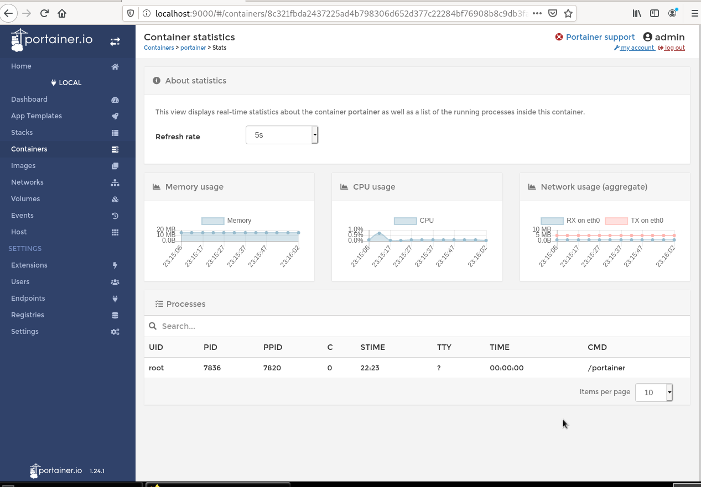

 # DOCKER PORTAINER
  
## Descripción Panel Control
*Primero nos metemos en local y nos iremos a la pagina dashboard, despues si nos dirigimos al menu containers, nos mostrará la lista de todos nuestros contenedores los cuales podremos ejecutar dandole al contenedor y pulsando start.*

 
 
 # Lista contenedores
 
 

*Tambien si pinchamos sobre el contenedor es decir si hacemos click podremos ver la informacion de el*

 

*Una vez hagamos click podemos inspeccionarlo o mirar los stats que es la memoria usada, el cpu y el internet*

 

# App templates

*Este puede ser uno de los apartados mas utiles de portainer ya que, desde aqui podemos crear un contenedor directamente muy simplemente sin tener que escribir en la linea de comando*

 

**Le dariamos a deploy the container y listo. Con las opciones avanzadas podriamos cambiar el puerto y el volumen**

 

 

# Vista imagenes

 

**Aqui podemos segun vemos en la foto:**

* Remove(borrar imagen)
* Pull image(Descargar imagen)
* Import (importar una imagen nueva ya descargada en local
* Export(Igual que importar pero a la inversa exportar la imagen que tengamos en portainer a local

# Network

*Aqui tenemos la posibilidad de ver las redes ya creadas y podemos administrarla es decir podemos borrarlas o crear nuevas*

 

# Volumes

*En este apartado encontraremos la lista de volumenes de los cuales disponemos y podremos administrar igual que en network, podemos borrarlas y añadir uno nuevo* 
 

**Igual que hemos mostrado en los contenedores si hacemos click tanto en una imagen como en un volumes nos mostrara su informacion, dejamos acontinuacion unas capturas que muestran un ejemplo de como se vería**

 
 
 

# Users

*Aqui tenemos una lista de usuarios y es donde se administra los usuarios de portainer, ademas podemos crear nuevos usuarios como vemos en la siguiente captura* 
 

# Setting

*Podemos cambiar la configuracion de portainer*

 

